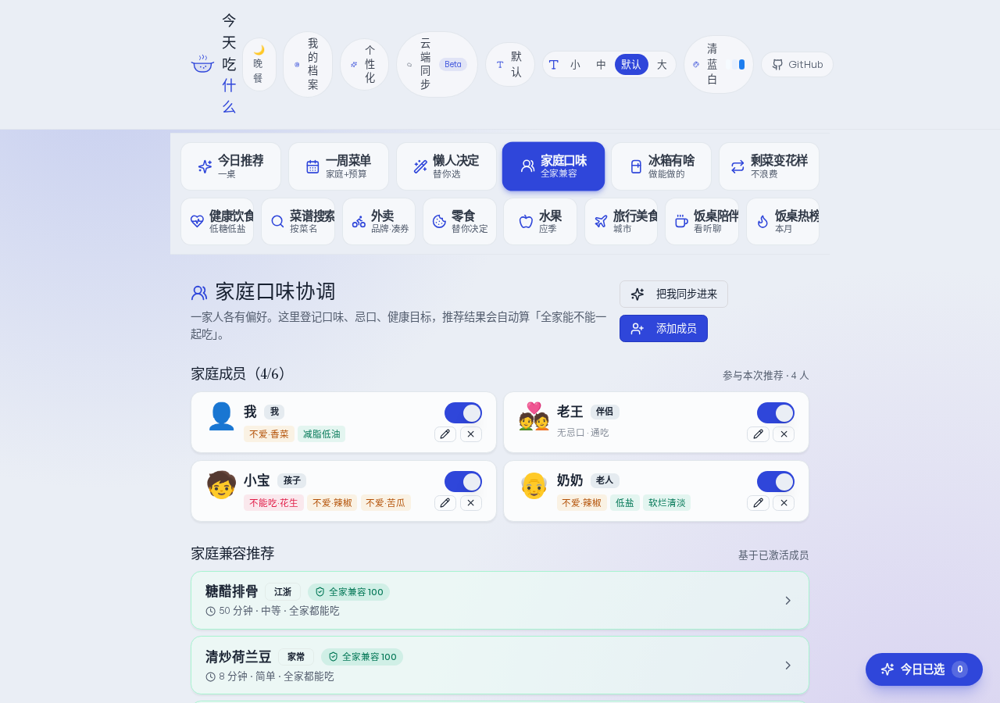
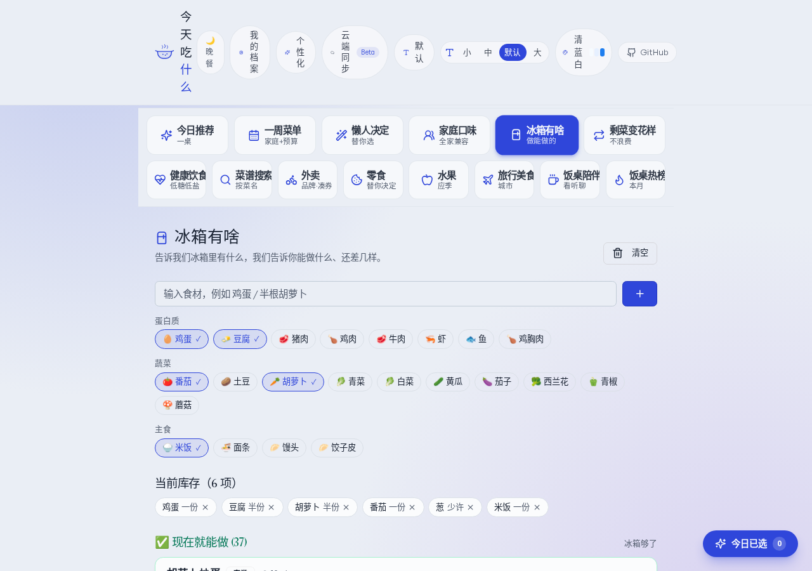
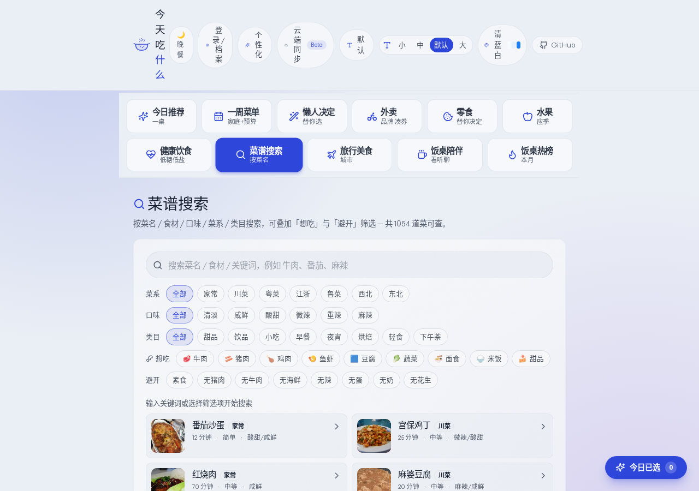

<div align="center">

# 饭搭子 · Fanda

### 今天吃什么 · 一键搞定吃 · 买 · 看 · 聊

替选择困难的人，一次性决定一桌菜、一次外卖、一份零食水果、一周买菜清单，
顺便把吃饭时看什么、聊什么、听什么也安排上。

[](https://meimengchengzhen.github.io/jin-tian-chi-shenme/)
[](https://www.perplexity.ai/computer/a/jin-tian-chi-shi-yao-JZA2UQlEQiqcDTqlYZnfsQ)
[](#技术栈)
[](#技术栈)
[](./LICENSE)

[在线体验](https://meimengchengzhen.github.io/jin-tian-chi-shenme/) · [功能总览](#功能总览) · [为什么做这个](#a为什么做这个解决方案) · [怎么实现的](#b具体怎么实现的) · [启发与发现](#c做完之后的启发与发现) · [本地运行](#本地运行--部署) · [路线图](#路线图)

</div>

---

## 一句话介绍

**饭搭子** 是一个面向「中午晚上不知道吃啥、点外卖刷半小时、零食货架站五分钟还在纠结」的中文用户的生活决定助手。
它把「吃什么、买什么、看什么、聊什么」收进同一个 PWA 网页里，纯前端、零登录、刷新就能用。

> 副标题保留 SEO 关键词「今天吃什么」「家常菜」「点外卖」「一周菜单」「饭桌话题」，方便搜索发现。

## 在线体验

| 入口 | 链接 | 备注 |
| --- | --- | --- |
| 🌐 GitHub Pages | <https://meimengchengzhen.github.io/jin-tian-chi-shenme/> | 主推。每次 push 到 `main` 自动构建并发布 |
| 🧪 Perplexity 预览 | <https://www.perplexity.ai/computer/a/jin-tian-chi-shi-yao-JZA2UQlEQiqcDTqlYZnfsQ> | 备用计算实例预览，可能受组织设置限制 |
| 📱 安装到手机 | 上面任一链接 → 浏览器「添加到主屏幕」 | PWA 已配置 manifest + Service Worker，离线 shell 可用 |

无需登录、不收集数据；所有偏好/收藏/历史默认只写浏览器 `localStorage`。

---

## 功能总览

顶部主导航已收纳为 **5 个一级入口**（v11）：**首页 · 家庭 · 搜索 · 健康 · 陪伴**（按钮高度更大、更易点）；其余的「一周菜单 / 懒人决定 / 冰箱有啥 / 剩菜变花样 / 外卖 / 零食 / 水果 / 旅行 / 热榜 / 单人一键 / 家庭一键」均作为二级入口在对应一级页面或 hash 路由（如 `#/solo`、`#/family-tonight`、`#/fridge`、`#/leftover`）下可达。子路由会自动保持对应一级 Tab 高亮。

| 模块 | 用一句话说 | 关键能力 |
| --- | --- | --- |
| **今日推荐** | 一桌家常菜随机搭好 | 1000+ 菜谱池 / 偏好筛选 / 锁定增量 / 多场景预设 / 热量评估 |
| **一周菜单** | 帮你排 7 天午+晚 + 估价 + 买菜清单 | 人数·预算·目标·忌口约束；蛋白频次平衡；按类目去重并合并 |
| **懒人决定** | 一键替你决定吃·买·看·聊全套 | 综合心情 / 天气 / 预算 / 人数；附「今日决定海报」生成 |
| **🏠 家庭口味协调（v10）** | 一家人都能一起吃 | 最多 6 位成员 · 过敏硬过滤 + 不爱软扣分 + 健康目标 · 全家兼容评分 |
| **🧊 冰箱有啥（v10）** | 现有食材能做啥 | 30+ 食材预设 · 别名规范化 · 命中率三档分组 · 缺什么一键复制 |
| **♻️ 剩菜变花样（v10）** | 昨天剩菜不浪费 | 20+ 类剩菜 / 50+ 变形方案 · 步骤清楚 · 冰箱联动 |
| **外卖** | 替你挑一家 + 备选 + 凑券提示 | 600+ 全国连锁品牌；按预算·人数·时段·减脂软筛 |
| **零食** | 替你决定一袋零食 | 300+ SKU；分类严格隔离（巧克力/糖果/酸奶/牛奶/坚果...） |
| **水果** | 应季 + 人群推荐 | 月份默认当地时间；标注热量·糖分·注意事项 |
| **健康饮食** | 低糖低盐/高蛋白/高纤等过滤 | 在 1000+ 菜谱上做软标签匹配；明确医疗免责声明 |
| **菜谱搜索** | 菜名 / 食材 / 口味 / 菜系 / 类目 / 难度 | 「为什么匹配」可解释高亮 |
| **旅行美食** | 选省 → 选市 → 看当地特色 | 50+ 城市；带豆瓣/小红书/B 站等搜索入口 |
| **饭桌陪伴** | 吃饭看什么 / 聊什么 / 听什么 | 45 影视 + 53 话题 + 42 音频；按场景·人数·档案打分 |
| **饭桌热榜** | 微博/百度/抖音/B站/知乎/头条 6 平台 | 多源 fallback；默认开启「敏感话题屏蔽」开关 |

辅助层：

- **菜谱详情**：食材热量·价格估算 · 视频搜索（B 站 / 抖音 / 百度）· 收藏 · 加入今日 · 真实示意图
- **今日记录浮窗**：右下角小 dock，累计今日已选的菜 / 外卖 / 零食 / 水果 / 看 / 聊；显示估算价格 + 估算热量 + 一键复制汇总文案
- **决定海报**：今日选择渲染成可截图的图卡（清爽 / 奶油 / 薄荷 / 夜宵 / 活力 / 极简 6 风格）
- **统一个人档案**：昵称 + 喜好 + 忌口 + 身高体重 + 饮食目标 + 个性化（角色 / 心情 / 健康关注）；多档案切换。首次进入弹窗与顶栏「我的档案」「个性化」入口共用同一份本地数据，互不重复
- **饮食计划**：Mifflin-St Jeor 公式估 BMR/TDEE，按餐次配比目标，结果区显示「人均合计 / 目标 / 偏轻·刚好·偏高」
- **环境上下文**：省份 + 城市 + 实时天气（Open-Meteo + BigDataCloud 反向地理，无 key）
- **餐次主题**：早 / 午 / 晚切换不同色调
- **整站主题 + 字号**：7 套主题（清爽蓝白默认）× 4 档字号（默认偏大）
- **PWA**：manifest + 手写 Service Worker（cache-first 静态、network-first HTML、子路径自动适配）
- **云端同步 Beta**：可选接入自己的 Supabase 实例，邮箱 OTP 登录跨设备同步

### v9 · 个性化推荐层（统一个人档案）

- **统一档案入口**：首次进入的「个性化设置」弹窗和顶栏「我的档案」「个性化」按钮 **共用同一份本地数据**，再也不是两套互相重复的用户信息体系：
  - 第一次访问会弹出一个轻量 3 步弹窗（角色 / 心情 / 数值，全部可跳过、可关闭）。
  - 弹完保存即同时写入 persona 与 active profile（自动建立昵称为「我」的档案，并把身高/体重/性别/年龄段同步到饮食计划），不再产生重复条目。
  - 此后点顶栏 **「我的档案」** 或 **「个性化」** 都会打开同一个 `ProfileDialog`，里面新增了「个性化」Tab —— 看到的就是首次弹窗里填的同一份数据，可继续修改。
  - 弹窗与档案对话框顶部都强调 **数据全部保存在本机浏览器里，不上传任何服务器**（沙箱预览环境会退回到内存态）。
  - 角色（一键决定 / 家庭掌勺 / 减脂控卡 / 健康忌口 / 外卖党 / 旅行美食 / 饭桌陪伴）选完可一键「去推荐入口」：减脂控卡 → 健康饮食 Tab，家庭掌勺 → 一周菜单 Tab，外卖党 → 外卖 Tab，懒人 → 懒人决定 Tab，旅行 → 旅行美食 Tab，陪伴 → 饭桌陪伴 Tab。
- **健康热量估算（仅参考）**：填了身高+体重后会显示 BMI / BMR / 估算每日活动 kcal / 建议摄入 kcal。公式来自 Mifflin-St Jeor + 轻度活动系数 1.4，**不是医学/营养诊断**，弹窗内有显眼免责说明。
- **画像如何影响推荐**：
  - `persona.healthFocus`（糖尿病/高血压/痛风/老年友好/低脂/低糖/低盐）会合并进 `recommend` 的健康软标签，例如「低盐」会让高盐酱料菜（豆瓣酱/老抽大勺/腊肉等）排序下沉。
  - `persona.moods`（忙/想犒劳/想清淡/想过瘾...）会追加到当前场景的 `energyHints`，让快手 / 暖胃 / 清爽 / 下饭等推荐倾向更贴近此刻状态。
- **卡片上的「喜欢 / 不喜欢 / 收藏」反馈按钮**：
  - 菜品（今日推荐 / 懒人）、零食、水果卡片右下都有 👍 / 👎，点了立即变高亮 → 写入本地反馈库。
  - 推荐侧实时感知：
    - 今日推荐 / 懒人主菜：被「喜欢」的菜下一轮加分（+1.6）；从喜欢菜里反推喜欢菜系/口味，让相似风格慢慢被推荐上来；被「不喜欢」的菜强降权（-4.0）。
    - 零食 / 水果：「不喜欢」会从候选池中剔除（候选还够多时）；「喜欢」直接给 score +8~+9。
    - 懒人主菜采用 weighted random：「喜欢」过的菜权重×3，「不喜欢」直接踢出候选。
- 反馈数据和老的「收藏」并存，不影响今日清单 / 历史等已有功能。本地不可用时（沙箱）自动退回内存态，关闭页面后清除。

> ⚠️ 健康相关字段仅做饮食偏好软排序与热量估算参考，**不构成医学/营养诊断**。如有糖尿病、高血压、痛风等特定情况，请以专业医生意见为准。


---

### v10 · 解决真实痛点：家庭口味 / 冰箱有啥 / 剩菜变花样

围绕三个用户反复提到的真实场景，**不引入登录、不接外部 API、不接真实数据库**，纯前端 + 本地 safe storage 实现：

#### 🏠 家庭口味协调（`#/family`）

> 一家四口众口难调 — 老人要清淡、孩子不吃辣、自己想减脂、伴侣口味又重。

- 最多 6 位家庭成员；字段：昵称（≤6 字）/ 角色（我·伴侣·孩子·老人·其他）/ 不爱吃 / 绝对不吃·过敏 / 健康目标（减脂·低盐·低糖·低嘌呤·高蛋白·软烂等）。
- 一键「把我同步进来」：从统一档案（profile.flavor）自动读出 restrictions 与 disliked tastes，转成家庭成员的 `allergicIngredients` / `dislikedIngredients`，**不会产生重复档案**。
- 推荐结果带**全家兼容评分**：
  - **Hard filter**：含任意 active 成员过敏/绝对不吃食材的菜谱直接降至 25 分以下并标红；
  - **Soft penalty**：不爱吃食材出现在核心食材里 -30、出现在文本里 -12；健康目标冲突按关键词命中扣分（如「低盐」遇「腊/酱/卤」-25）；
  - 角色默认：孩子对「重辣/麻辣」-35、对「微辣」-12；老人对「重辣/麻辣」-25。
- 卡片上明确标 `全家兼容 100` / `部分兼容 75` / `有冲突`；点开后看具体谁哪点不合适。
- 个人 likes/dislikes 复用：喜欢过的菜 +5 分，不喜欢过的菜 -12 分。
- 临时禁用某成员（如出差）— 切换 `active` 即可，无需删除。

#### 🧊 冰箱有啥（`#/fridge`）

> 冰箱里就半根胡萝卜两个鸡蛋半盒豆腐 — 这能做啥？

- 输入或快捷选食材（蛋白质 / 蔬菜 / 主食三组预设 30+ 项），自动**别名规范化**（西红柿→番茄、芫荽→香菜、马铃薯→土豆…），可调数量（少许/半份/一份/很多）。
- 命中率算法：取菜谱核心食材（已剔除葱姜蒜油盐糖等家常调味），按"已有食材数 / 核心食材数"计算 0–100%；
  - **现在就能做** ≥80%（绿条）— 锁定即烹饪；
  - **再买一两样** 50–79%（橙条）— 带"还差 X"明示；
  - **差得有点多** <50%（灰条折叠）。
- 与家庭模式联动：active 家庭成员存在时，**硬过敏菜直接过滤**；全家兼容菜 +6，硬冲突菜 -25。
- 与 likes/dislikes 联动：喜欢的菜 +8，不喜欢的菜 -18。
- 缺什么一键复制成清单文本，可粘到买菜清单 / 备忘录。

#### ♻️ 剩菜变花样（`#/leftover`）

> 昨天的红烧肉剩半份，今天怎么变花样不重复？

- 输入剩菜 / 从 17 个常见剩菜快选（红烧肉·白切鸡·清蒸鱼·番茄炒蛋·米饭·饺子·火锅·汤…），选剩余量（一小碗·约半份·大半份）。
- 静态规则表覆盖 **20+ 类剩菜，约 50 个变形方案**（红烧肉 → 拌面 / 梅菜扣肉饭 / 馒头夹 / 萝卜烧；剩米饭 → 蛋炒饭 / 焗饭 / 粥 / 紫菜饭团 …）。
- 每个方案含：新菜名 / 难度（超简单·家常·有点费工）/ 额外耗时 / 需要的额外食材 / 3-5 步做法 / 场景标签（省时·下饭·暖胃·孩子爱·老人友好…）。
- 与冰箱联动：方案的额外食材已在冰箱中标 `✅ 冰箱有·X`，没在冰箱里的标 `还要·X`，并提供「复制还差的清单」按钮。
- 无规则匹配时**自动降级**到通用兜底方案：万能炒饭 / 万能盖浇面 / 万能粥 / 万能蔬菜汤 / 万能卷饼 — 永远不空白。
- 排序按剩余量软调：一小碗优先低耗时方案；大半份允许中等难度。

#### 工程要点（v10）

- 三大模块共用 `lib/ingredientAliases.ts`：100+ 别名映射 + 调味/常备识别 + 菜谱核心食材抽取。
- 评分函数全部纯函数、可解释，UI 中给出原因（"不爱·香菜"、"差胡萝卜"、"冰箱有·豆腐"）。
- 数据全用 `lib/storage.ts` 的 `safeGet/safeSet`：localStorage 不可用（沙箱预览/隐私模式）时退回内存态，绝不让 storage 异常打挂 UI。
- 顶部导航新增 3 个 Tab，但仍是两排网格布局；首页中段新增「解决真实问题」入口卡（与「今天的场景」并列），不让页面变冗杂。

> ⚠️ 估算/匹配仅作参考。过敏与严格忌口请最终自行确认；剩菜请确认未变质再食用，建议 24-48 小时内吃完。

---

### v11 · 两类人群 · 两个一键方案 · 导航收纳

针对站内最常见的两类用户**「一个人想随便吃点」**和**「一家人晚上要决定」**，各给一条最短动线，把所有要看 / 要点 / 要做的全部塞进一张结果卡里：

- **一个人也要好好过（`#/solo`）** — 「一键安排今晚」轻量结果页：选心情 / 怎么吃 / 预算档（省钱·正常·犒劳），1-2 次点击得到主餐 + 外卖备选 + 零食 ×2 + 水果 + 看 + 听 + 一句安慰，附预算 / 热量估算 + 一键加入今日清单。「再来一份」用 seed 确定性轮换 — 同一筛选下每点一次都换主推。
- **家庭一键今晚饭（`#/family-tonight`）** — 把「家庭口味协调」「冰箱有啥」「剩菜变花样」三大痛点串成单页：根据全家成员忌口与冰箱状态，给一桌「主菜 + 蔬菜 + 汤 + 主食」的兼容方案，并就地标出每个人的兼容评分。

**顶部主导航**改为 5 个一级入口（`home / family / search / health / companion`，按钮高度 h-12 大点击区），不再依赖横向滚动 / 拖动；旧的 weekly / lazy / fridge / leftover / hotboard 等模块作为二级入口仍可达。子路由会保持对应的一级 Tab 高亮。

**外卖推荐刷新修复**：`pickTakeout` 接受 `seed` + `recentBrandIds`，把原本的 `Math.random()` 替换为 seed 驱动的抖动 + 顶部 12 个候选轮换。修复了「犒劳 / lunch / 健康轻食」这类筛选条件下，分数差距过大让单一品牌（如 Wagas 沃歌斯）连续刷出的问题；同 seed 仍给确定性结果。`check:recommend` 新增断言：犒劳模式连续 30 次刷新至少出现 6 家不同品牌、相邻两次同一家 < 4 次。

> 注：本仓库**不接外部实时数据 / 不调外卖商家 API**；外卖品牌库为静态 305 条 A+B 真实连锁，刷新逻辑只作本地排序。

---

## 截图 / 演示

> 想直接动手试？点 **[在线预览](https://meimengchengzhen.github.io/jin-tian-chi-shenme/)** 比看图更快。

桌面端（1280 × 900，全部为最新真实截图，由 Playwright 在生产构建上自动生成）：

| 模块 | 截图 |
| --- | --- |
| 今日推荐 — 一桌家常菜随机搭好 |  |
| 一周菜单 — 7 天午+晚 + 预算买菜清单 |  |
| 懒人决定 — 一键替你决定吃·买·看·聊 |  |
| **🏠 家庭口味协调（v10）** — 全家忌口/口味/健康目标兼容评分 |  |
| **🧊 冰箱有啥（v10）** — 现有食材命中率三档分组 |  |
| **♻️ 剩菜变花样（v10）** — 50+ 静态变形方案 + 冰箱联动 |  |
| 外卖 — 600+ 品牌按预算·人数·时段筛选 |  |
| 零食 — 300+ SKU 分类严格隔离 |  |
| 水果 — 应季 + 人群推荐 |  |
| 健康饮食 — 低糖低盐 / 高蛋白 / 高纤 |  |
| 菜谱搜索 — 「为什么匹配」可解释高亮 |  |
| 饭桌陪伴 — 吃饭看 / 聊 / 听 |  |
| 饭桌热榜 — 6 平台多源 fallback + 敏感屏蔽 |  |
| 统一个人档案（v9）— 首次轻量弹窗 + 顶栏「我的档案 / 个性化」共用同一份本地数据 |  |

移动端（390 × 844）：

<p>
  
  &nbsp;
  
</p>

> 顶部模块选项栏不再 sticky / fixed：两排大按钮位于普通文档流中，向下滚动会自然离开视口，不再遮挡内容（桌面端、手机端一致）。

> 截图脚本：[`script/screenshot.mjs`](./script/screenshot.mjs)。先 `npm run build && NODE_ENV=production node dist/index.cjs`，再 `node script/screenshot.mjs` 即可全量再生。

---

## 「为什么 / 怎么做 / 学到了什么」

### A. 为什么做这个解决方案

**真实的痛点不是「菜谱不够」，而是决定本身**。市面上 4 类应用都有缺口：

- **菜谱站**：菜很多，但每次还是要自己翻、自己挑、自己估时间预算 — 最累的那一步没解决。
- **外卖 App**：算法只在乎你下单，不在乎是不是真的合适当下心情 / 健康 / 同伴。
- **「随机吃」小程序**：随机出来的菜往往跟你的厨房 / 时间 / 人数毫无关系，是娱乐，不是工具。
- **饭桌「看什么聊什么」**：散落在豆瓣、B 站、小宇宙等平台，没人一次性整理给一桌人。

**为什么用「AI/规则化推荐」而不是纯随机？** 选择困难真正难的不是没选项，而是约束多：「人少·没时间·孩子在·想清淡·上次刚吃了红烧肉·预算 50 块·还想配个汤」— 用户连开口描述都嫌烦。
所以饭搭子用「**轻量规则推荐 + 软兜底自动放宽**」：
硬性忌口绝不让步，软性偏好打分，候选不足时**逐级放宽难度 → 菜系 → 用时**，并把放宽过程**显式提示给用户**。这比纯随机更尊重约束，又比 LLM 更可解释、零成本、零延迟。

### B. 具体怎么实现的

#### 技术栈

| 层 | 选型 |
| --- | --- |
| 框架 | **React 18** + **Vite 7** + **TypeScript 5.6** |
| 路由 | **wouter** + Hash router（GitHub Pages 子路径友好） |
| UI | **Tailwind CSS 3.4** + **Radix UI** + 自定义主题层（CSS 变量） |
| 字体 | Fontshare General Sans + Gambarino |
| 图标 | lucide-react |
| 状态 | React 本地 state + `safeGet/safeSet` 封装的 localStorage（隐私模式自动退回内存） |
| 数据 | 全部静态 TS / JSON：1000+ 菜谱、300+ 零食、600+ 外卖品牌、50+ 城市美食、若干水果 / 影视 / 话题 / 音频 |
| 估算 | 自写：人均热量、单道菜价、一桌人均价、BMR/TDEE（Mifflin-St Jeor）|
| 网络 | Open-Meteo（天气，无 key）+ BigDataCloud（反向地理，无 key）+ Unsplash Source / Wikimedia（图片）+ 6 大热搜公开端点 |
| 后端 | Express 入口保留为空壳；当前完全静态前端 |
| 持久化 Beta | Supabase（**用户自带**，前端只用 anon key + RLS） |
| 部署 | GitHub Actions → GitHub Pages（`.github/workflows/deploy-pages.yml`） |
| PWA | 手写 Service Worker（cache-first 静态、network-first HTML、子路径 scope 自适配） |

#### 数据结构与推荐逻辑

- **菜谱**（`client/src/data/recipes.ts` + `recipes.generated.ts`）= 64 道手写核心菜 + 998 道脚本扩展菜（主料 × 风格 × 蔬菜搭配 + 水果 / 甜品 / 烘焙 / 饮品 / 小吃模板组合），统一 `Recipe` 接口对应仓库根 [`recipes.schema.json`](./recipes.schema.json)。
- **推荐算法**（`client/src/lib/recommend.ts`）：
  1. 硬过滤：忌口 8 类绝不让步；
  2. 候选不足时逐级放宽难度 → 菜系 → 用时上限，UI 同步提示；
  3. 打分：口味 +1.4 / 菜系 +0.6 / 难度 +0.4 / 短时 +0~0.3 / 随机扰动 +0~0.6；档案喜好、收藏、历史去重、场景倾向叠加加权；
  4. 分类抽样：在 main / veggie / soup / staple 各取 Top N 再随机；
  5. 锁定增量：用户「锁住」的菜跳过重抽。
- **场景预设**（`client/src/lib/scenarios.ts`）：7 个场景（个人控卡 / 全家晚餐 / 快手上班餐 / 儿童友好 / 长辈清淡 / 健身增肌 / 周末下厨），每个预设默认人数 / 餐次 / 难度 / 时间 / 倾向口味 + caloriePriority + tableStyle 桌面结构偏好。
- **一周家庭菜单**（`client/src/lib/familyWeekly.ts`）：输入人数·成人/孩子/老人·月预算·周预算·外卖次数·目标·忌口；输出 7 天午+晚菜单、蛋白频次、估价、按 `肉蛋奶 / 蔬菜 / 主食豆制品 / 调味杂项` 4 组去重合并的买菜清单。
- **零食 / 外卖 / 水果**：`pickXxx()` 在静态数据池里按当前分类、人群、预算、时段做严格筛选 + 软评分。
- **饭桌陪伴**（`client/src/lib/companionRecommend.ts`）：影视 / 话题 / 音频按 `场景 + 人数 + 餐次 + 用时 + 档案年龄` 打分；家庭聚餐优先合家欢、儿童友好、长辈友好；话题主动避开政治宗教等敏感方向。
- **饭桌热榜**（`client/src/lib/hotBoard.ts`）：6 平台公开端点多源 fallback；任何端点失败回内置静态样例；默认开启敏感词屏蔽（政治 / 冲突 / 灾难 / 刑案 / 地域歧视）。
- **餐次热量**：每道菜 `lib/calories.ts` 缓存人均热量；与 `profile.ts` 的餐次目标软匹配。
- **图片**：`lib/imageProvider.ts` 优先用 Wikimedia / Unsplash Source 关键词图，失败 fallback 到渐变 + emoji（`dishVisual.ts`），不依赖私有 CDN。
- **PWA**：见 `client/public/sw.js`，VERSION 化缓存名 + SKIP_WAITING；`registerSW.ts` 仅在生产构建时注册，dev 模式跳过。
- **性能**：路由级 lazy（`LazyDecisionPanel` / `LazyMealsPanel` / `LazyWizardDialog`）；图片 lazy + fallback；列表虚拟化对热榜 / 菜谱搜索均有应用；GitHub Pages 子路径全部用相对路径。
- **部署**：push `main` → GitHub Actions 自动 `npm ci` + `npm run build` + 上传 `dist/public/` 到 Pages。

### C. 做完之后的启发与发现

- **选择困难不是「选项不够」，是「约束太多」**。预算、健康、场景、心情、家庭结构、娱乐陪伴是同一件事的多个面，单做一个菜谱站是解决不完的。
- **一桌饭其实是「内容包」**：吃 + 看 + 聊 + 听。把这四件事拆分到不同 App 既费事又费心，集中给一个「替我决定」的入口反而最舒服。
- **规则推荐 + 显式放宽** 在小数据集（≤ 千条）上比 LLM 更可解释、更稳定、更便宜。LLM 更适合放在「为什么推荐它」「怎么做这道菜」的内容生成环节，而不是核心决策。
- **软兜底比硬报错友好得多**。「鲁菜 + 进阶 + 15 分钟」这样的极端组合不应让用户面对空白页，UI 应明确告诉他「我自动放宽了 X」。
- **本地为主、云端为辅** 是这种轻量工具最合适的姿态：默认零登录、零上传，需要跨端再用自己的 Supabase。
- **后续值得做的方向**：实时菜价（接菜场 / 美团买菜接口）、个性化账号下的口味学习、真实地图与外卖平台 deep link、家庭成员协同清单、相机识别冰箱剩菜推荐做法。

---

## 本地运行 / 部署

环境：Node.js ≥ 18，npm ≥ 9。

```bash
git clone https://github.com/meimengchengzhen/jin-tian-chi-shenme.git
cd jin-tian-chi-shenme
npm install
npm run dev          # http://localhost:5000
```

构建生产产物：

```bash
npm run build        # 静态站点：dist/public/
                     # 服务器入口（如需）：dist/index.cjs
```

类型检查 + 推荐算法冒烟测试：

```bash
npm run check            # tsc 类型检查
npm run check:recommend  # 推荐算法 + 忌口 + 数据库规模冒烟测试
```

重新生成扩展菜谱（基于模板组合）：

```bash
npm run gen:recipes      # 写入 client/src/data/recipes.generated.ts
```

#### 部署到 GitHub Pages

仓库 `.github/workflows/deploy-pages.yml` 已配置：每次 push 到 `main` 自动 build + 发布；fork 后在仓库 `Settings → Pages → Source: GitHub Actions` 启用即可。

#### 截图（再生）

仓库自带 [`script/screenshot.mjs`](./script/screenshot.mjs)，使用 Playwright 在生产构建上自动跑遍 10 个主 Tab + 2 张移动端：

```bash
npm run build
NODE_ENV=production node dist/index.cjs &     # 启动生产服务，端口 5000
npx playwright install --with-deps chromium    # 首次需安装浏览器
node script/screenshot.mjs                     # 写入 docs/screenshots/*.png
```

脚本会预先在 `localStorage` 写入 `chishenme.onboarded.v1=1` 跳过新手引导，桌面 1280 × 900、手机 390 × 844 / DSR 2。CI 自动化截图见路线图。

#### 云端同步 Beta（可选 · Supabase）

> 默认是**纯前端**：所有档案、收藏、历史都在你的浏览器 localStorage，不上传。

1. 新建 Supabase 项目，在 SQL Editor 执行 [`supabase/migration.sql`](supabase/migration.sql)（`user_profiles` / `user_state` / `favorites` / `history` / `preferences` 5 张表，全部启用 RLS）；
2. 复制 `.env.example` 为 `.env`，填 `VITE_SUPABASE_URL` + `VITE_SUPABASE_ANON_KEY`（**仅 anon key，绝不能用 service_role**）；
3. GitHub Pages 部署时把这两个变量加到仓库 `Settings → Variables` 并在 workflow 注入；
4. 启用后顶部「云端同步 Beta」可邮件 OTP 登录 → 推送本地快照 / 从云端合并。

未配置时面板提示「未配置 Supabase，本地数据仍可用」，所有功能 100% 可用。详见 [docs/supabase.md](docs/supabase.md)。

---

## 数据来源与免责声明

- **菜谱 / 零食 / 外卖品牌 / 城市美食 / 影视 / 话题 / 音频** 全部为人工整理或脚本生成的静态数据，便于离线运行与社区贡献，不抓取任何商业 API。
- **价格、热量、营养** 均为基于通用配方的**估算值**（食材热量主数据库见 `client/src/data/ingredients.ts`），实际数值受品牌、份量、烹饪方式影响。
- **饭桌热榜** 优先调用各平台公开端点；任何端点失败/超时/被墙都自动降级到内置静态示例。**热榜内容会随时间变化**，截图与当日数据可能不一致。
- **菜品图片** 优先 Wikimedia / Unsplash Source 关键词图，失败时回渐变 + emoji；详情页明确标注「示意图」。
- **健康相关字段**（BMR/TDEE/目标摄入）用 Mifflin-St Jeor 公式估算，**仅作饮食规划参考，不构成医学/营养建议**。任何饮食、过敏、慢病决定请咨询专业医生 / 注册营养师。

---

## 项目结构

```
jin-tian-chi-shenme/
├── client/
│   ├── index.html              # 标题 / 字体 / favicon / manifest 引用
│   ├── public/
│   │   ├── favicon.svg         # 自定义 SVG 图标
│   │   ├── manifest.webmanifest
│   │   └── sw.js               # 手写 Service Worker（PWA）
│   └── src/
│       ├── App.tsx             # Hash router
│       ├── main.tsx            # 入口 + SW 注册 + 主题初始化
│       ├── index.css           # 设计系统：陶土 + 米白；多主题；data-meal 餐次主题
│       ├── components/
│       │   ├── MainTabs.tsx              # ★ 顶部 11 入口两排导航
│       │   ├── DishDetail.tsx            # 菜品详情（热量/价格/视频/收藏）
│       │   ├── ProfileDialog.tsx         # 统一档案：个性化 / 账户 / 喜好 / 饮食计划 / 环境
│       │   ├── WeeklyMenuPanel.tsx       # ★ 一周菜单 + 预算
│       │   ├── LazyDecisionPanel.tsx     # ★ 懒人决定
│       │   ├── TakeoutPanel.tsx          # 外卖
│       │   ├── SnacksPanel.tsx           # 零食
│       │   ├── FruitPanel.tsx            # 水果
│       │   ├── HealthPanel.tsx           # 健康饮食
│       │   ├── SearchPanel.tsx           # 菜谱搜索
│       │   ├── TravelPanel.tsx           # 旅行美食
│       │   ├── CompanionPanel.tsx        # 饭桌陪伴
│       │   ├── HotBoard.tsx              # 饭桌热榜
│       │   ├── DecisionPoster.tsx        # 今日决定海报
│       │   ├── TodayDock.tsx             # 今日记录浮窗
│       │   ├── CategoryBrowser.tsx       # 甜品/饮品/小吃/早餐 等门类浏览
│       │   ├── CloudSyncDialog.tsx       # Supabase 云端同步 UI
│       │   └── ui/                       # Radix + tailwind 通用组件
│       ├── data/                # 静态数据池
│       │   ├── recipes.ts / recipes.generated.ts
│       │   ├── snacks.ts / snacks.generated.ts
│       │   ├── takeout.ts / takeoutBrands.ts / takeoutBrands.generated.ts
│       │   ├── fruits.ts / cityFoods.ts / companions.ts
│       │   ├── ingredients.ts / lazyMeals.ts
│       │   └── ...
│       ├── lib/
│       │   ├── recommend.ts              # ★ 推荐算法 + 评分
│       │   ├── familyWeekly.ts           # ★ 家庭一周菜单
│       │   ├── hotBoard.ts               # 热榜聚合 + 敏感屏蔽
│       │   ├── companionRecommend.ts     # 看/聊/听推荐
│       │   ├── profile.ts                # 档案 + BMR/TDEE
│       │   ├── calories.ts               # 人均热量缓存
│       │   ├── environment.ts            # 省/市/天气/季节
│       │   ├── geoWeather.ts             # Open-Meteo + BigDataCloud
│       │   ├── theme.ts / pageSize.ts / mealTheme.ts  # 主题 / 字号 / 餐次
│       │   ├── selectedToday.ts          # 今日记录浮窗状态
│       │   ├── history.ts / recentPool.ts# 历史 / 去重
│       │   ├── cloudSync.ts              # Supabase 同步逻辑
│       │   ├── storage.ts                # 安全 localStorage
│       │   └── registerSW.ts             # PWA 注册
│       └── pages/
│           └── Home.tsx                  # ★ 主页面，挂载所有 Tab
├── server/                     # Express 入口（当前空壳，预留）
├── shared/                     # 前后端共享类型（预留）
├── supabase/migration.sql      # 云端同步建表 SQL
├── script/
│   ├── build.ts                # 构建产物组装
│   ├── check-recommend.ts      # 推荐算法冒烟测试
│   └── generate-recipes.ts     # 生成扩展菜谱
├── docs/
│   ├── screenshots/            # README 引用的截图
│   └── supabase.md             # 云端同步配置教程
├── recipes.schema.json         # 菜谱 JSON Schema
├── .github/workflows/deploy-pages.yml
├── CONTRIBUTING.md             # 贡献指南
├── LICENSE                     # MIT
├── tailwind.config.ts
├── vite.config.ts
└── package.json
```

★ 标记的是产品逻辑入口，绝大多数迭代只需要改这几个文件。

---

## 路线图

| 时间 | 模块 | 想做的事 |
| --- | --- | --- |
| **短期（1-2 月）** | 截图 CI | GitHub Actions 跑 Playwright 自动更新 README 截图（含一周菜单 / 懒人 / 热榜等占位） |
| 短期 | 菜谱数据层 | 抽离成独立 JSON 仓库，社区 PR 贡献；补图片字段；引入 IndexedDB 替代部分 localStorage |
| 短期 | 营养展示 | 给详情页补蛋白 / 脂肪 / 碳水 / 钠的范围估值，可比较 |
| **中期（3-6 月）** | 真实价格 | 接 1-2 个公开菜场价格源，给买菜清单加「本周参考价区间」 |
| 中期 | 个性化 | 点赞 / 不喜欢的口味学习；本地小模型重排候选 |
| 中期 | 外卖深链 | 美团 / 饿了么搜索 deep link 与城市级品牌分布 |
| **长期** | 协同 | 家庭账号下，多成员共同维护「不吃 / 想吃」清单 |
| 长期 | i18n | 英文版给海外华人 / 学做菜的外国朋友 |
| 长期 | 视觉识别 | 相机识别冰箱剩菜推荐做法 |

---

## 贡献

非常欢迎贡献，最受欢迎的是**菜谱**！

- 加菜：见 [CONTRIBUTING.md](./CONTRIBUTING.md) 的「贡献菜谱」 + 用 [`recipes.schema.json`](./recipes.schema.json) 校验。
- 加零食 / 外卖 / 城市 / 影视 / 话题：直接 PR 对应 `client/src/data/*.ts` 文件。
- 提 Bug / 功能建议：开 [GitHub Issue](../../issues/new)。
- PR 前请通过检查清单（见 [CONTRIBUTING.md](./CONTRIBUTING.md#四pr-检查清单)），保持中文内容规范，避免引入需要 API key 的服务。

分支命名 / 提交信息 / PR 检查清单也都在 [CONTRIBUTING.md](./CONTRIBUTING.md)。

## 许可证

[MIT](./LICENSE) · 欢迎 fork / remix / 自带菜谱来交朋友。

---

<div align="center">

**饭搭子** 是一个工具，也是一种姿态：
不替你做饭，只替你做决定。一桌菜、一周计划、一袋零食、一段视频、一句话题 —— 一次搞定。

少花点时间想「今天吃什么」🍲，多花点时间真正吃。

</div>
